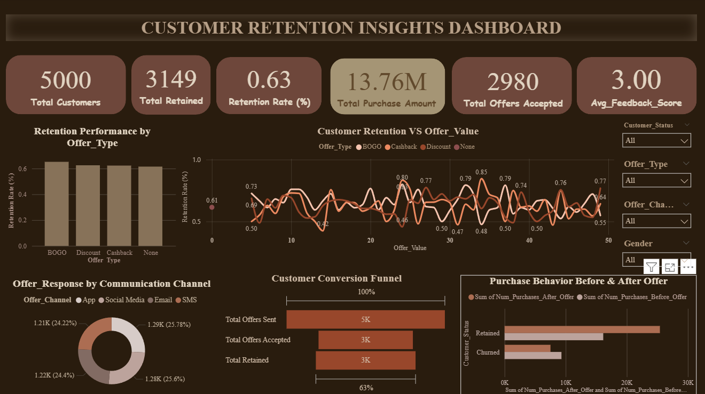

# Customer Retention Strategy – Offer Effectiveness Analysis

## Project Overview
This project analyzes customer retention patterns to evaluate the effectiveness of different promotional offers and communication channels. Using Power BI, the dashboard tracks retention rates, offer acceptance, purchase behavior, and churn to identify strategies that improve customer engagement and reduce attrition.

The analysis helps businesses understand which offers and channels contribute most to retaining customers and increasing post-offer revenue.

---

## Dashboard Preview

---

## Key Metrics
- Total Customers: 5,000
- Total Retained Customers: 3,149
- Overall Retention Rate: 63%
- Total Purchase Amount: 13.76M
- Total Offers Accepted: 2,980
- Average Feedback Score: 3.0

---

## Dashboard Insights
- BOGO and Discount offers demonstrate higher retention rates compared to Cashback and No-offer categories.
- Email and App communication channels result in higher offer acceptance than SMS and Social Media.
- Customers who accept offers show a noticeable increase in purchase value after receiving offers.
- Retained customers contribute significantly more revenue compared to churned customers.
- Offer effectiveness directly impacts both customer retention and overall revenue growth.

---

## Analysis Covered
- Retention performance by offer type
- Offer response by communication channel
- Customer retention vs offer value
- Customer conversion funnel
- Purchase behavior before and after offers

---

## Tools Used
- Power BI – Data modeling and interactive dashboard creation
- Excel – Data preprocessing and data validation

---

## Files Included
- Customer_Retention_Analysis.pptx – Project presentation
- Customer_Retention_Analysis_Report.pdf – Detailed project report
- Dashboard screenshot – Visual summary of insights

---

## Outcome
The project provides data-driven insights to design effective customer retention strategies by selecting the right offer types and communication channels, helping businesses reduce churn and maximize customer lifetime value.
  
